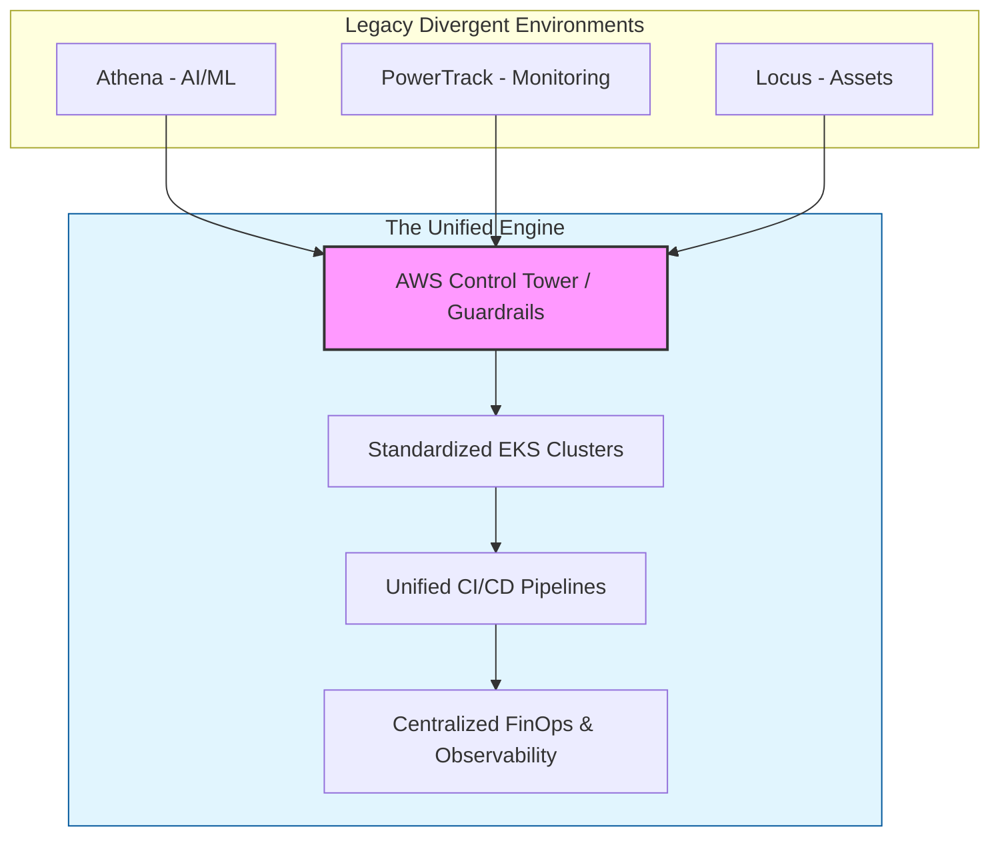

# Stem Unified Cloud Engine (SUCE)

### Platform Unification & Standardization Roadmap

## 🎯 The Vision

To solve the "Three-Platform Challenge," this repository provides a **Golden Path** architecture. It is designed to consolidate **PowerTrack, Athena, and Locus** into a single, high-velocity engine. By standardizing Infrastructure-as-Code (IaC) and Observability, we reduce technical debt and allow Stem’s engineers to focus on **Energy Intelligence**, not infrastructure management.

---

## 🏗️ High-Level Architecture

The following diagram illustrates the transition from siloed legacy environments to a **Unified Global Landing Zone**.

---

## 🛠️ Core Components

### 1. Platform Unification (Infrastructure-as-Code)

Using **Terraform**, we provide a library of "Stem-Standard" modules. This ensures that whether a team is deploying a Python microservice for Athena or a .NET worker for PowerTrack, the underlying AWS infrastructure is identical in security and performance.

* **Modular EKS:** Pre-configured with VPC best practices and IAM roles.
* **Multi-Database Support:** Standardized patterns for **DynamoDB, TimescaleDB, and RDS**.

### 2. Full-Stack Observability

Integration with **Datadog and OpenSearch** to create a "Single Pane of Glass."

* **AIOps Ready:** ML-driven anomaly detection to identify battery telemetry lags before they impact the grid.
* **SLO/SLI Dashboards:** Real-time reliability tracking for critical energy assets.

### 3. Security & Compliance (NIST / SOC 2)

Security is shifted left. Every deployment in this repo automatically undergoes:

* **Static Analysis:** Scanning for credential leaks and open ports.
* **Inherited Compliance:** Using AWS Systems Manager and KMS to ensure encryption and audit trails are always "on."

### 4. FinOps & Cost Optimization

* **Resource Life-cycling:** Automated cleanup of non-production environments.
* **Visibility:** Tagging strategy that correlates AWS spend directly to the specific platform (Athena vs. PowerTrack).

---

## 🚀 Impact on Velocity

| Metric | Before Unification | With Unified Engine |
| --- | --- | --- |
| **Onboarding Time** | Weeks (Manual Setup) | Hours (Self-Service) |
| **Security Audits** | Manual/Reactive | Continuous/Automated |
| **Deployment Frequency** | Weekly/Monthly | Daily/On-Demand |
| **MTTR (Recovery)** | High (Fragmented Logs) | Low (Unified Tracing) |

---

## 📂 Repository Structure

* `/terraform`: Standardized AWS modules (EKS, VPC, RDS).
* `/pipelines`: Unified GitHub Actions / GitLab CI templates.
* `/monitoring`: Datadog dashboard-as-code and SLO definitions.
* `/compliance`: NIST and SOC 2 guardrail policies (OPA/Checkov).

---

## 👨‍💻 About the Architect

This project was developed with a **"Public Trust"** mindset—prioritizing security, reliability, and cost-efficiency to support the global energy transition.

---